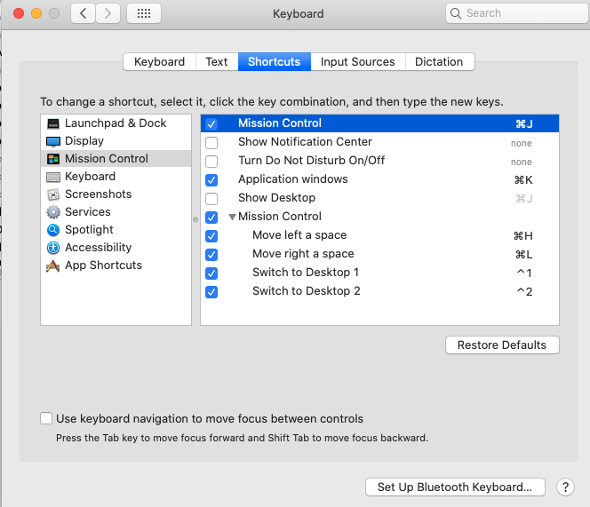

## Computer Setup for MacOS

1. Install xcode from Apple Store
2. Install iterm2
3. Install homebrew: https://brew.sh/
4. Install karabiner-elements

After installing karabiner-elements, install the config `./karabiner.json`
```
mv ~/.dotfiles/macos-dotfiles/karabiner.json ~/.config/karabiner/
```

5. Create ssh-keys: `ssh-keygen -m PEM -t rsa`
6. Install emacs: https://emacsformacosx.com/
7. Install tmux
See https://github.com/ChrisJohnsen/tmux-MacOSX-pasteboard/

```
brew install reattach-to-user-namespace tmux
```

8. Install Solarized Light theme for iterm2
Open `iterm-theme/solarized_light.itermcolors` in iterm2

9. Update finder to show full paths
```
defaults write com.apple.finder _FXShowPosixPathInTitle -bool true; killall Finder
```

10. Install mission control commands


